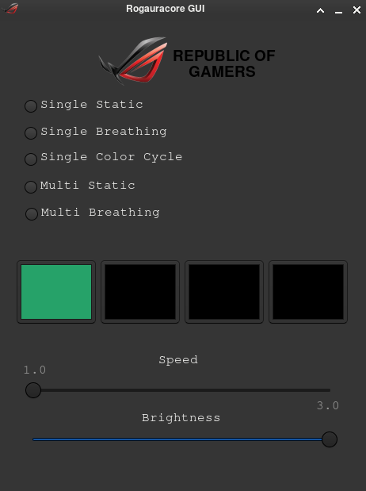

# Rogauracore GUI 

GUI wrapper for `rogauracore` used for changing RGB effects for asus ROG Laptops.
Be sure you have `rogauracore` installed before using this program.
You can get it here: https://github.com/wroberts/rogauracore

# Usage
	make
	sudo make install
	roggui
